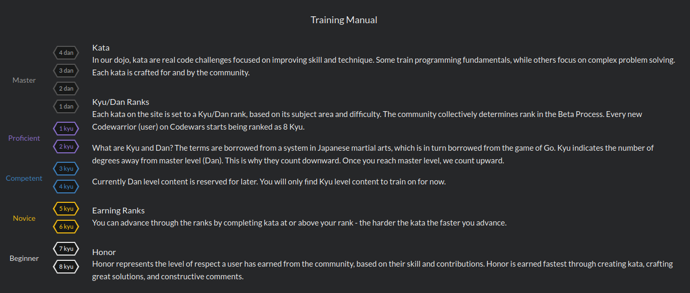

# :cowboy_hat_face: Codewars Solutions :cowboy_hat_face:
<!-- Terminal CMD to update ReadMe Code: npm run docs -->
A collection of Code Wars Solutions by Adam Shappy

My Current Rank: .

**Disclaimer**: This is by no means the best solution for these problems.



## Table of Contents
<details><summary>Click to expand all problems!</summary>
 * random
 * random
</details>
---

#### [Create Phone Number](https://www.codewars.com/kata/525f50e3b73515a6db000b83) | [Solution](https://github.com/mrshappy0/codewars/blob/master/js-solutions/Create-Phone-Number.js)

**Problem** (6kyu):

_Write a function that accepts an array of 10 integers (between 0 and 9), that returns a string of those numbers in the form of a phone number._

<!-- AUTO-GENERATED-CONTENT:START (CODE:src=./js-solutions/Create-Phone-Number.js) -->
<!-- The below code snippet is automatically added from ./js-solutions/Create-Phone-Number.js -->
```js
createPhoneNumber = (numbers, n = numbers.join("")) =>
  `(${n.slice(0, 3)}) ${n.slice(3, 6)}-${n.slice(6, 10)}`;
```
<!-- AUTO-GENERATED-CONTENT:END *-->

---

#### [Adjacent Repeated Words in a String](https://www.codewars.com/kata/5245a9138ca049e9a10007b8) | [Solution](https://github.com/mrshappy0/codewars/blob/master/js-solutions/Adjacent-repeated-words-in-a-string.js)

**Problem** (6kyu):

*You know how sometimes you write the the same word twice in a sentence, but then don't notice that it happened? For example, you've been distracted for a second. Did you notice that "the" is doubled in the first sentence of this description?*

*As as aS you can see, it's not easy to spot those errors, especially if words differ in case, like *"as"* at the beginning of the sentence.*

*Write a function that counts the number of sections repeating the same word (case insensitive). The occurence of two or more equal words next after each other count as one.*

<!-- AUTO-GENERATED-CONTENT:START (CODE:src=./js-solutions/Adjacent-repeated-words-in-a-string.js) -->
<!-- The below code snippet is automatically added from ./js-solutions/Adjacent-repeated-words-in-a-string.js -->
```js
countAdjacentPairs = (searchString, p1 = /\b(\w+)\b\s+\1\b\s*(\1\b\s)*/gi) =>
  searchString === "" ? 0 : (searchString.match(p1) || []).length;
```
<!-- AUTO-GENERATED-CONTENT:END *-->

---

#### [Persistent Bugger](https://www.codewars.com/kata/55bf01e5a717a0d57e0000ec) | [Solution](https://github.com/mrshappy0/codewars/blob/master/js-solutions/Persistent-bugger.js)

**Problem** (6kyu):

_Write a function, persistence, that takes in a positive parameter num and returns its multiplicative persistence, which is the number of times you must multiply the digits in num until you reach a single digit._

<!-- AUTO-GENERATED-CONTENT:START (CODE:src=./js-solutions/Persistent-bugger.js) -->
<!-- The below code snippet is automatically added from ./js-solutions/Persistent-bugger.js -->
```js
persistence = (num, i = 0, ar = []) => {
  return num
    .toString()
    .split("")
    .reduce((a, b) => a * b).length === 1
    ? i
    : persistence(
        num
          .toString()
          .split("")
          .reduce((a, b) => a * b),
        i + 1
      );
};
```
<!-- AUTO-GENERATED-CONTENT:END *-->
---

#### [Two Sum](https://www.codewars.com/kata/52c31f8e6605bcc646000082) | [Solution](https://github.com/mrshappy0/codewars/blob/master/js-solutions/Two-Sum.js)

**Problem** (6kyu):

_Write a function that takes an array of numbers (integers for the tests) and a target number. It should find two different items in the array that, when added together, give the target value. The indices of these items should then be returned in a tuple like so: (index1, index2)._

_For the purposes of this kata, some tests may have multiple answers; any valid solutions will be accepted._

_The input will always be valid (numbers will be an array of length 2 or greater, and all of the items will be numbers; target will always be the sum of two different items from that array)._

<!-- AUTO-GENERATED-CONTENT:START (CODE:src=./js-solutions/Two-Sum.js) -->
<!-- The below code snippet is automatically added from ./js-solutions/Two-Sum.js -->
```js
function twoSum(numbers, target) {
  let arr = [],
    arr_mod = numbers.forEach((el, i) => {
      if (numbers.slice(i + 1).includes(target - el)) {
        arr.push(i);
        arr.push(numbers.slice(i + 1).indexOf(target - el) + i + 1);
      }
    });
  return arr;
}
```
<!-- AUTO-GENERATED-CONTENT:END *-->
---

#### [Calculator](https://www.codewars.com/kata/5235c913397cbf2508000048) | [Solution](https://github.com/mrshappy0/codewars/blob/master/js-solutions/Calculator.js)

**Problem** (3kyu):

_Create a simple calculator that given a string of operators (), +, -, *, / and numbers separated by spaces returns the value of that expression_

<!-- AUTO-GENERATED-CONTENT:START (CODE:src=./js-solutions/Calculator.js) -->
<!-- The below code snippet is automatically added from ./js-solutions/Calculator.js -->
```js
const Calculator = function () {
  this.evaluate = (string) => {
    let m = /(\S*)(\s)([/*])(\s)(\S*)/,
      s = /(\S*)(\s)([-+])(\s)(\S*)/;
    mOrD = (str) => {
      let finalStr = str.replace(m, (match, p1, p2, p3, p4, p5) => {
        return p3 === "/" ? Number(p1) / Number(p5) : Number(p1) * Number(p5);
      });
      return finalStr === str ? finalStr : mOrD(finalStr);
    };
    string = mOrD(string);
    aOrS = (str) => {
      let finalStr = str.replace(s, (match, p1, p2, p3, p4, p5) => {
        return p3 === "-" ? Number(p1) - Number(p5) : Number(p1) + Number(p5);
      });
      return finalStr === str ? finalStr : aOrS(finalStr);
    };
    return (string = aOrS(string));
  };
};
```
<!-- AUTO-GENERATED-CONTENT:END *-->